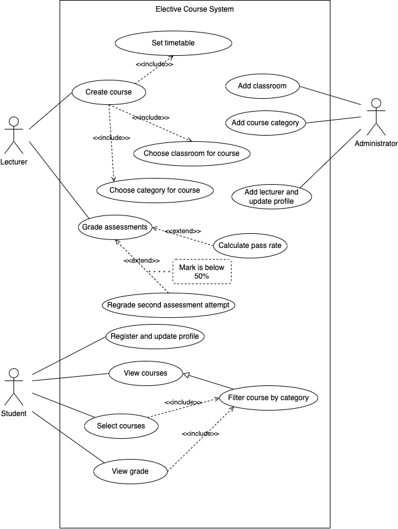

## Project Scope
To enrich the students' knowledge base, the college provided many elective courses. 
The courses are grouped into di;erent categories. A Lecturer can provide multiple courses 
for more than one category.
A student can choose more than one courses based on his or her interests.
There are a few classrooms. One classroom can hold many elective courses.
The Lecturer of the course gives mark for each student and store it into the database.
The database on the back end should have the following entities:
• Course
• Category
• Student
• Lecturer
• Classroom
• Grade

## Actors
- Student
- Lecturer
- Administrator

## Use Cases

### Brief Description

| Use case                          | Brief use case description 
|-----------------------------------|----------------------------
| Add classroom                     | Administrator enters new classroom data, and the system creates a classrooms record.
| Add course category               | Administrator enters new category data, and the system creates a category record.
| Add lecturer and update profile   | Administrator enters new lecturer data, and the system creates a lecturer record. Administrator modifies a lecturer's data, the system updates the record.
| Create course                     | Lecturer enters new course data, the system create a course record.
| Choose classroom for course       | Lecturer selects a classroom when creating a course, the system sets the column value in the record.
| Choose category for course        | Lecturer selects a category when creating a course, the system sets the column value in the record.
| Set timetable                     | Lecturer enters the timetable when creating a course, the system sets the column value in the record.
| Grade assessments                 | Lecturer enters the scores of students of a course, the system creates records with student id and course id.
| Calculate pass rate               | Lecturer enters the score value of passing line, the system returns the number of records filtered by score value.
| Regrade second assessment attempt | Lecturer enters the course name, student name and the new score value, the system update the grade records, when the first assessment's mark is below 50%.
| View courses                      | Student requests to view all courses, the system returns all the records.
| Filter course by category         | Student selects a category, then requests to view courses, the system returns records filtered by category column value.
| Select courses                    | Student views courses, he or she may filter courses by category. Then the student confirm to enroll a course, the system creates a record with course ID and student ID.
| View grade                        | Student enters the course name, the system returns the grade record by using student ID and course name.
| Register and update profile       | Student enters name, email address, the system creates a record or updates corresponding column value for existing record.

## Use Case Diagram

