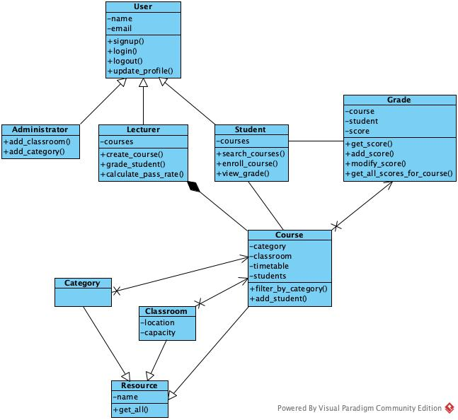

## Project Scope
To enrich the students' knowledge base, the college provided many elective courses. 
The courses are grouped into different categories. A Lecturer can provide multiple courses 
for more than one category.
A student can choose more than one courses based on his or her interests.
There are a few classrooms. One classroom can hold many elective courses.
The Lecturer of the course gives mark for each student and store it into the database.

## Class Design
There are three roles - administrator, lecturer, student, they are both the user of the system. So there should be an abstract class User, and three subclasses - Administrator, Lecturer and Student.

The administrator adds multiple categories. Each one is an instance object. So there should be a class Category.

The system contains different kind of courses, each course can be an instance object. So there should be a class Course.

The system contains several classrooms, each classroom can be an instance object. So there should be a class Classroom.

Each student has a grade for a enrolled course, which is an instance object. So there should be a class Grade.

Both Category, Classroom and Course are kind of options to be selected by other object. So there should be a base class Resource.

## Class Diagram

